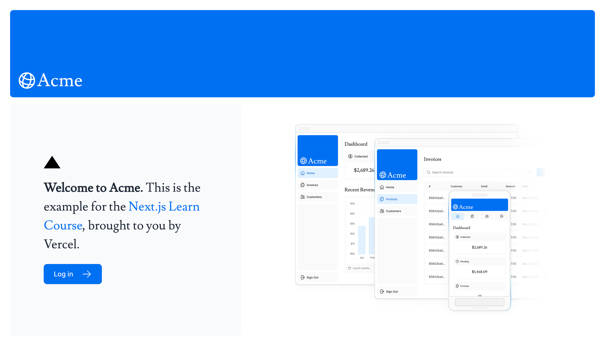
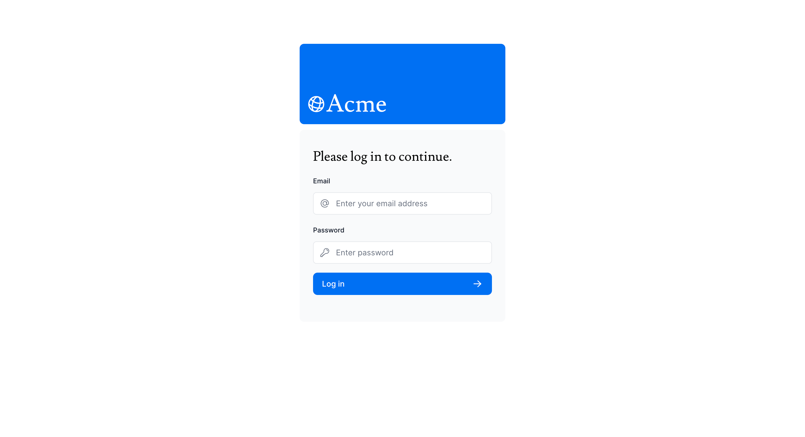
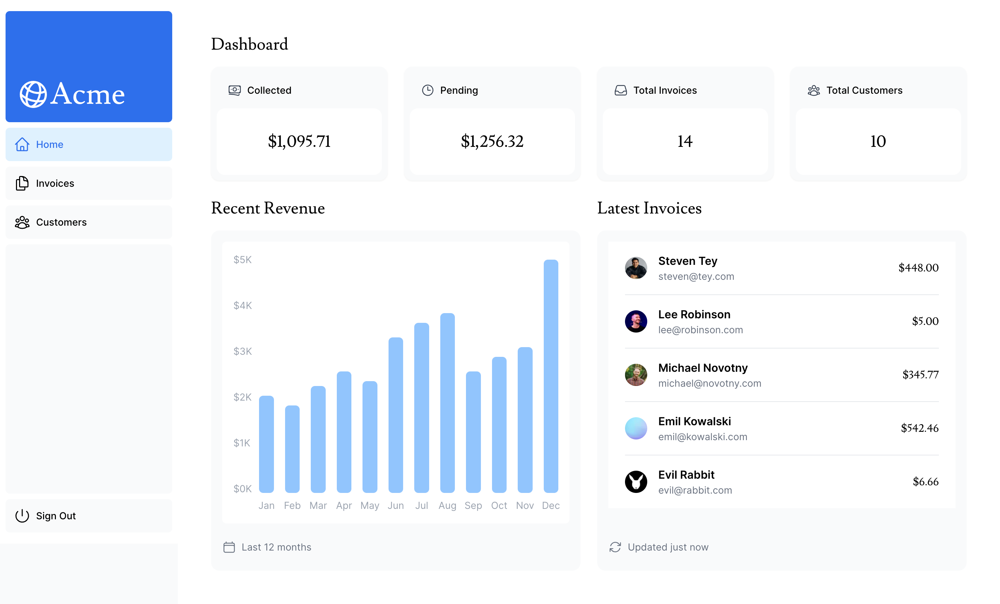
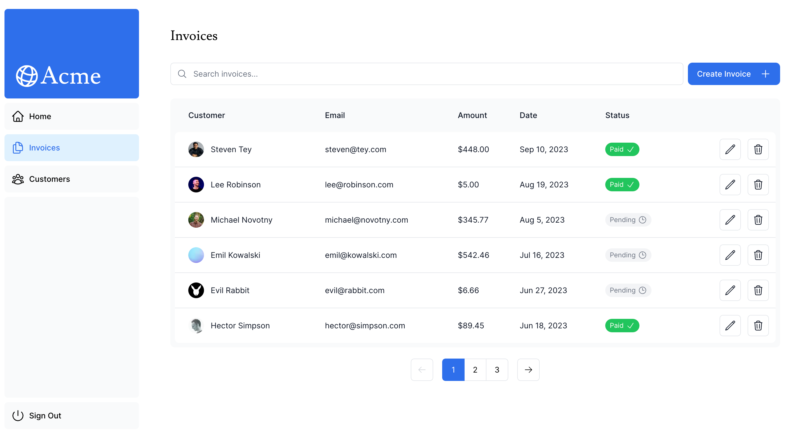
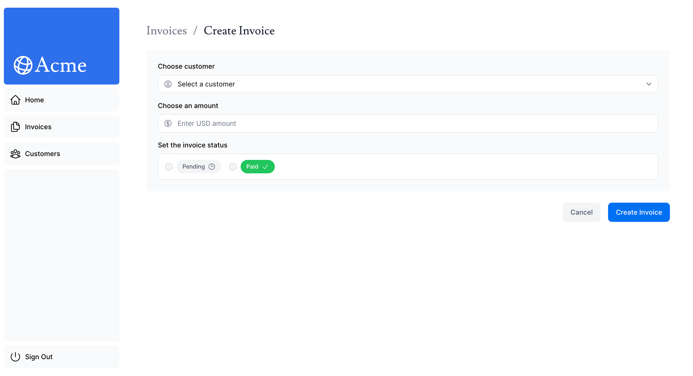
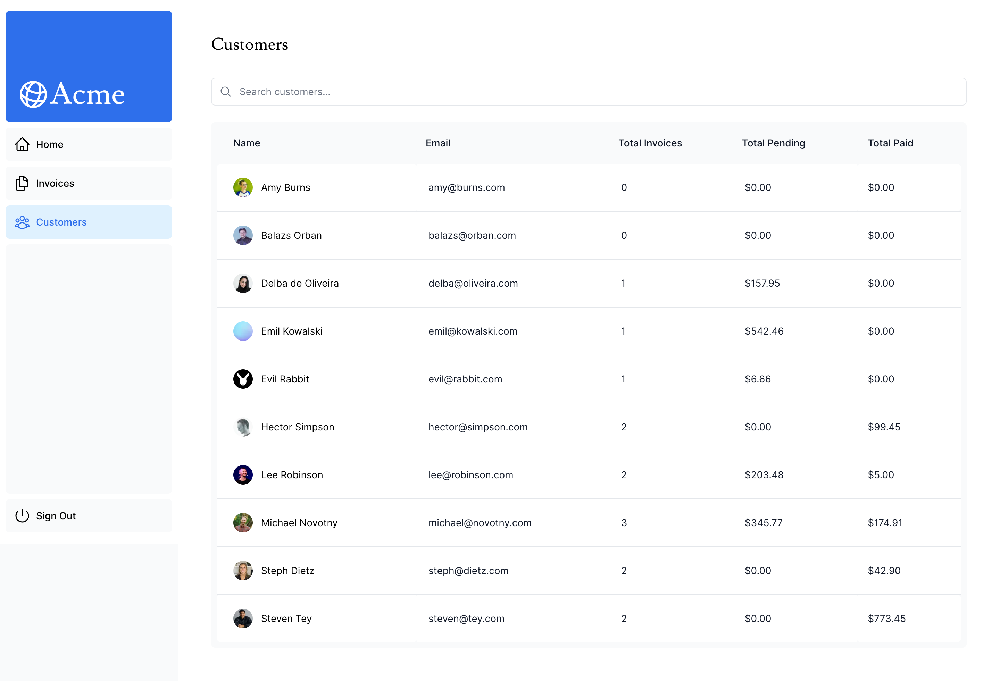

# Next.js Acme Dashboard Page

## Table of contents

- [Screenshots](#screenshots)
- [Links](#links)
- [Built with](#built-with)
- [Login Infos](#login-infos)
- [Author](#author)

### Screenshots

#### Home Page

#### Login Page

#### Dashboard Page

#### Invoices Page

#### Create Invoice Page

#### Edit Invoice Page

#### Customers Page

### Links

- Live Site URL: [Vercel](https://next-js-acme-dashboard.vercel.app/)

## My process

### Built with

- Next.js 14
- Typescript
- PostgreSQL
- Tailwind CSS
- Google Fonts

### Login Infos

- Email: user@nextmail.com
- Password: 123456

## Author

- Linkedin - [Taha](https://www.linkedin.com/in/tahaaykiroglu)
